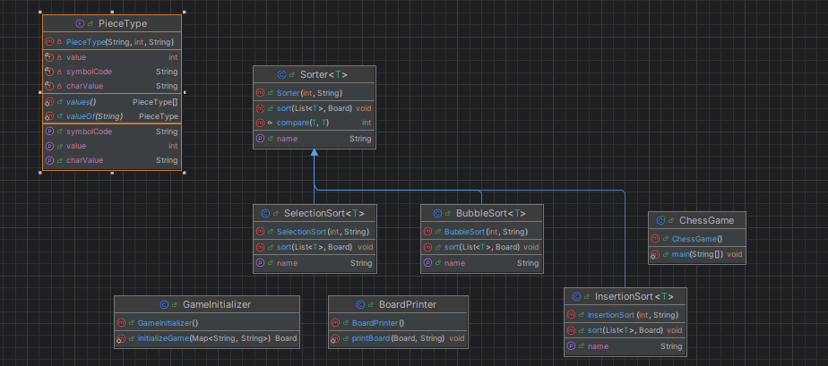

# Chess Game Project
======================

## Overview
------------

This project is a Java-based implementation of a chess game that includes various sorting algorithms to arrange the pieces on the board. The game allows users to select the type of pieces, color, and sorting algorithm to use.

## Features
------------

* Generates chess pieces based on user input (type, color, and number of pieces)
* Implements various sorting algorithms (Bubble Sort, Insertion Sort, Selection Sort) to arrange the pieces on the board
* Displays the initial and sorted board configurations
* Allows users to select the delay between each sorting step
* Validates user input parameters

## Project Structure
---------------------

The project is organized into the following packages:

* `board`: Contains classes related to the chess board and pieces (e.g., `Board`, [Piece](cci:2://file:///C:/Users/agustin/Desktop/Capstone/src/board/Piece.java:2:0-33:1), `PieceType`)
* `game`: Contains classes related to the game logic (e.g., [ChessGame](cci:2://file:///C:/Users/agustin/Desktop/Capstone/src/game/ChessGame.java:6:0-68:1), `Validator`)
* `sorting`: Contains classes related to the sorting algorithms (e.g., [Sorter](cci:2://file:///C:/Users/agustin/Desktop/Capstone/src/sorting/Sorter.java:5:0-24:1), [BubbleSort](cci:2://file:///C:/Users/agustin/Desktop/Capstone/src/sorting/BubbleSort.java:6:0-36:1), [InsertionSort](cci:2://file:///C:/Users/agustin/Desktop/Capstone/src/sorting/InsertionSort.java:5:0-43:1), [SelectionSort](cci:2://file:///C:/Users/agustin/Desktop/Capstone/src/sorting/SelectionSort.java:6:0-38:1))

## Key Classes and Methods
---------------------------

### Board

* Represents the chess board and provides methods for placing pieces and printing the board configuration.

### Piece

* Represents a chess piece and provides methods for getting its symbol and type.

### PieceGenerator

* Generates chess pieces based on user input.

### Sorter

* Abstract class that provides a basic sorting algorithm and is extended by the specific sorting algorithm classes.

### BubbleSort, InsertionSort, SelectionSort

* Implementations of the respective sorting algorithms.

## Usage
---------

To run the game, execute the [ChessGame](cci:2://file:///C:/Users/agustin/Desktop/Capstone/src/game/ChessGame.java:6:0-68:1) class with the following command-line arguments:

* `-a <algorithm>`: Select the sorting algorithm (e.g., `b` for Bubble Sort, `i` for Insertion Sort, `s` for Selection Sort)
* `-t <type>`: Select the type of pieces (e.g., `n` for normal, `c` for custom)
* `-c <color>`: Select the color of the pieces (e.g., `b` for black, `w` for white)
* `-r <number>`: Select the number of pieces to generate
* `-s <delay>`: Select the delay between each sorting step (in milliseconds)

Example usage:
```bash
java ChessGame -a b -t n -c b -r 8 -s 1000
```
## diagram



